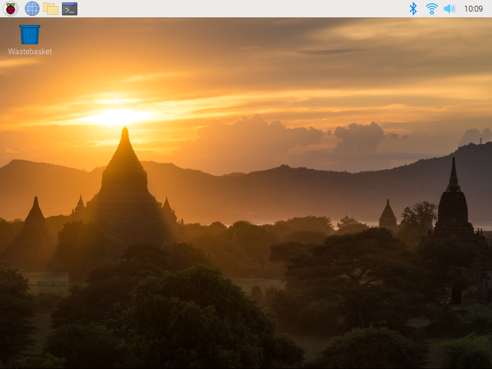
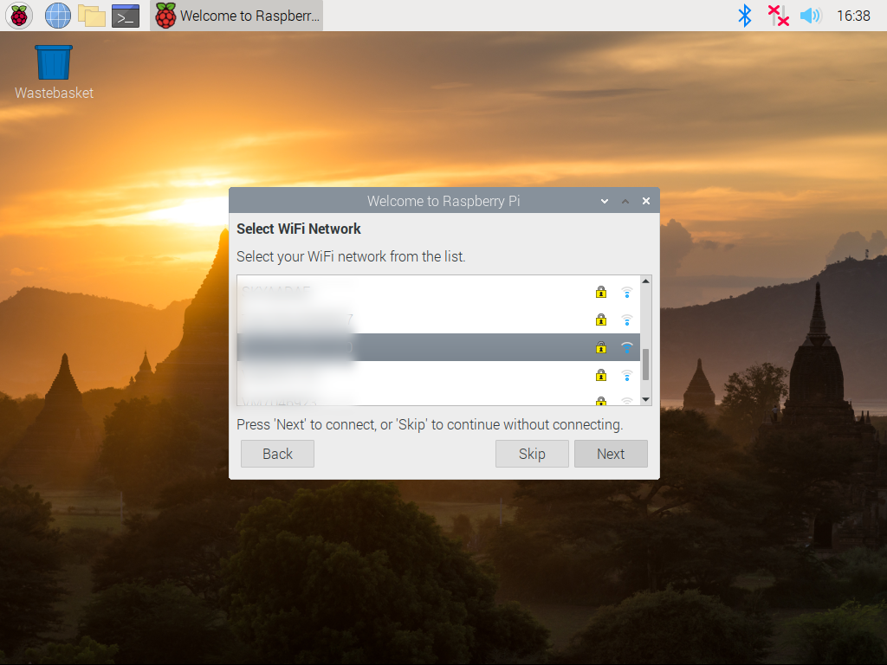
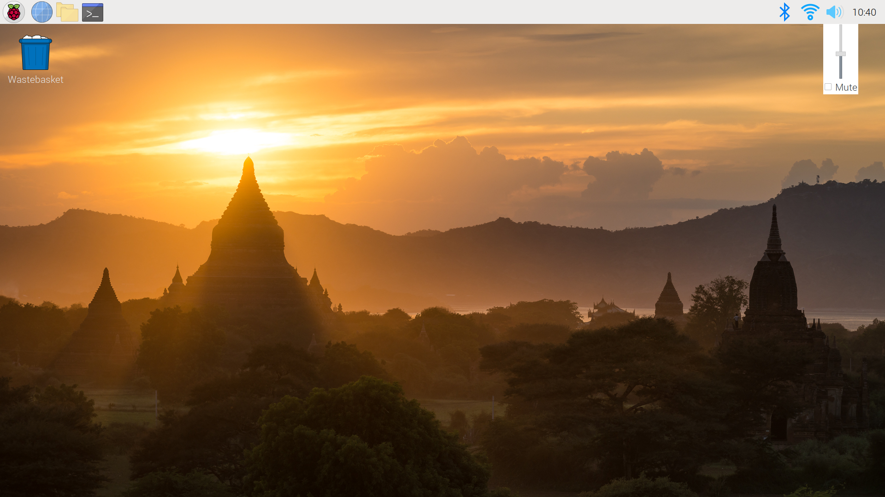
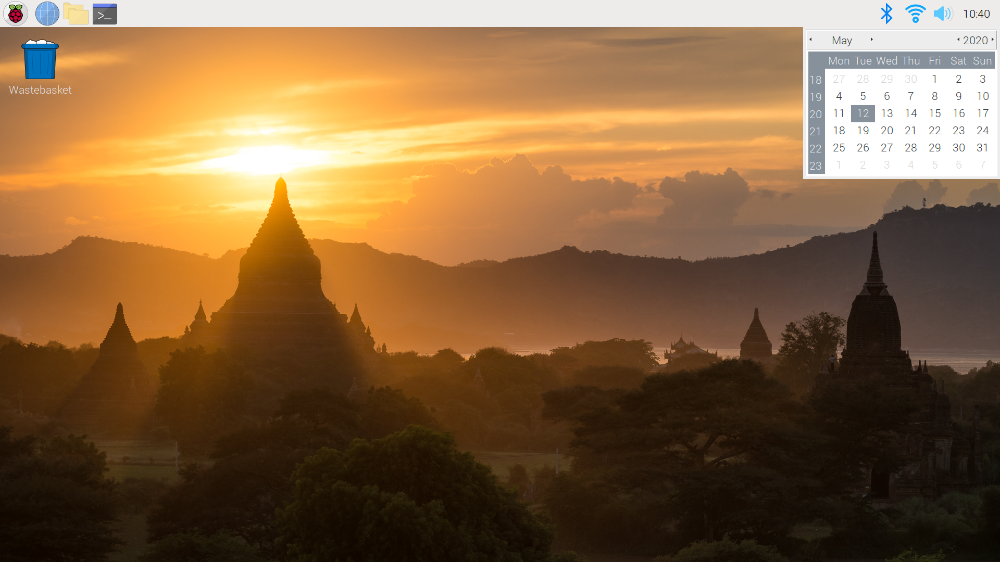
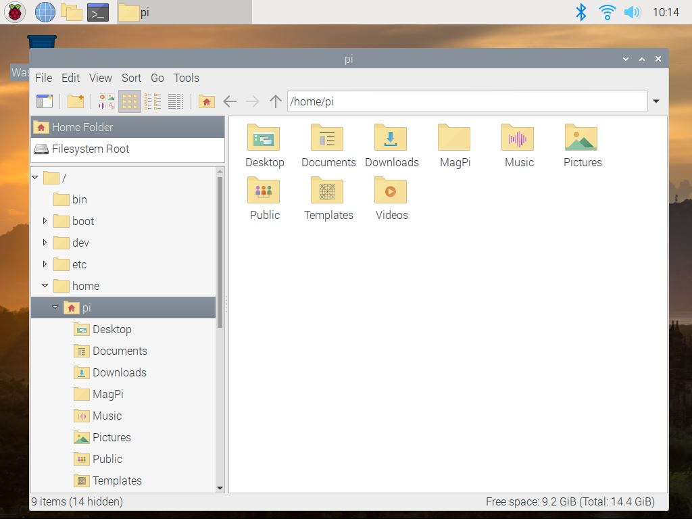
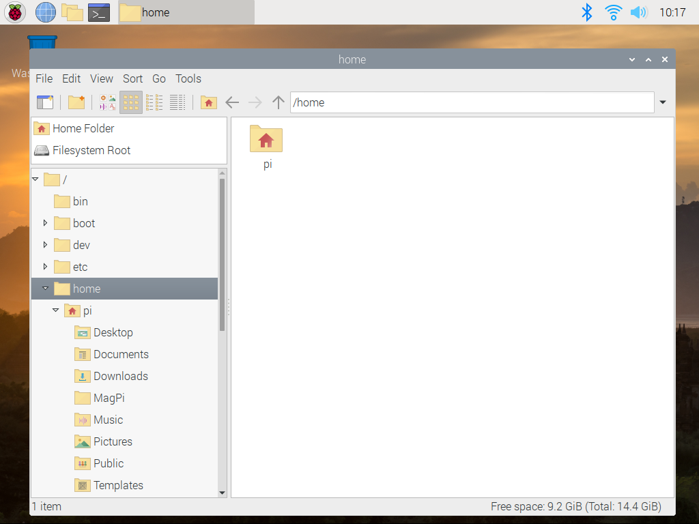
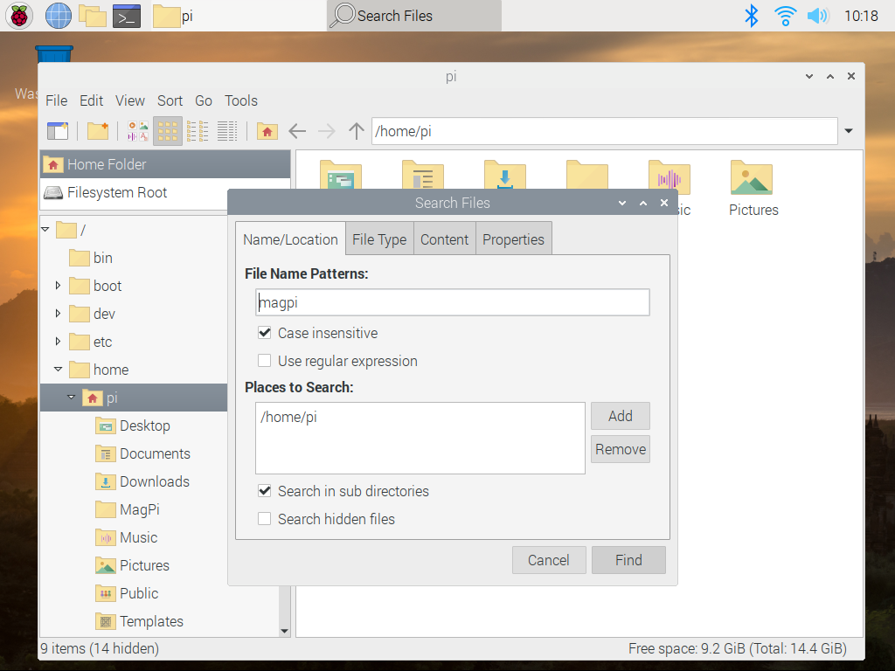
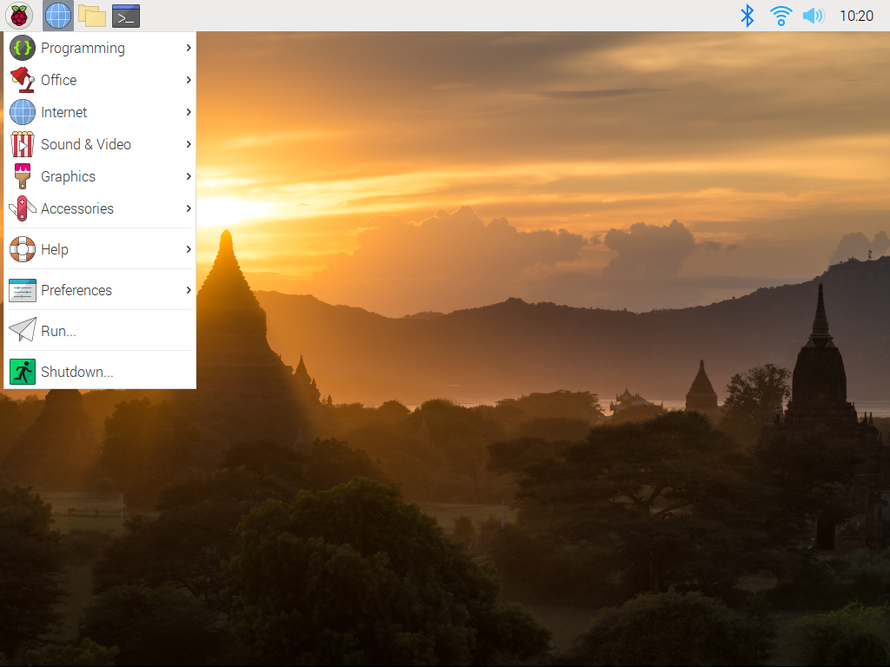
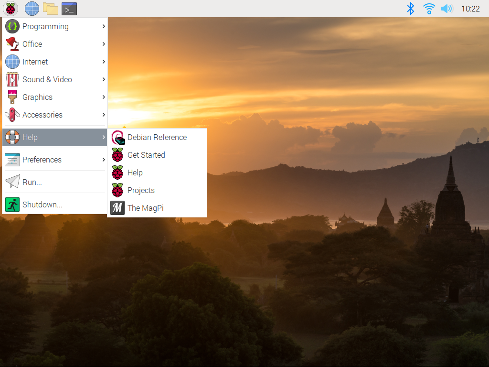
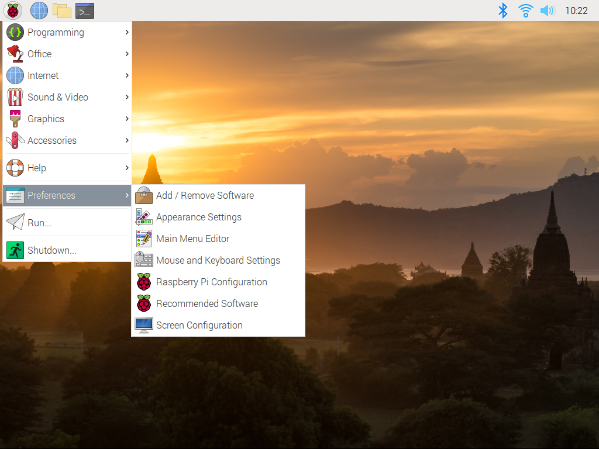

# Raspberry Pi OS
Se familiariser avec le système d'exploitation Raspberry Pi

* [Visite du bureau](#Visite-du-bureau)

Faites une visite guidée du bureau Raspberry Pi et personnalisez-le à votre guise.

## Visite du bureau

> Dans cette étape, vous apprendrez à vous repérer dans votre Raspberry Pi, afin de pouvoir démarrer des applications et gérer vos fichiers.

L'interface utilisateur graphique du système d'exploitation Raspberry Pi s'appelle Raspberry Pi Desktop, ou simplement le bureau. Le bureau ressemble à ceci:

### Fond d'écran

L'image d'arrière-plan qui couvre la majeure partie de l'écran s'appelle le **Fond d'écran**; plus tard dans ce cours, je vous montrerai comment le changer.

### Corbeille à papier

Sur le bureau, vous verrez la **Corbeille**, où vous pouvez trouver les fichiers supprimés. Vous pouvez faire un clic droit sur la corbeille à papier et choisir «Vider la corbeille» si vous avez besoin de libérer de l’espace.

### Barre des tâches

En haut de l'écran se trouve la **Barre des tâches**. Certaines des applications les plus fréquemment utilisées peuvent être lancées directement à partir de la barre des tâches en cliquant sur leurs icônes.

### Barre d'état système

Sur le côté droit se trouve la **barre d'état système**, où vous pouvez voir l'état du Bluetooth, de la mise en réseau et du son. Vous pouvez cliquer sur ces icônes pour afficher ou modifier les paramètres.

Si vous n'êtes connecté à aucun réseau, le symbole de réseau dans la barre d'état système apparaîtra sous la forme de deux lignes verticales grises se terminant par une croix rouge. Une fois que vous êtes connecté à un réseau WiFi, cela deviendra une icône WiFi bleue. Cliquez dessus pour afficher les réseaux disponibles et basculer entre les réseaux.

Cliquez avec le bouton gauche sur l'icône Son pour régler le volume; cliquez avec le bouton droit sur l'icône Son pour basculer la sortie audio entre analogique (qui sort via la prise audio 3,5 mm) et HDMI (lorsque vous utilisez un moniteur avec un haut-parleur intégré).

Cliquez sur l'heure pour afficher un calendrier.

### Gestionnaire de fichiers

Le gestionnaire de fichiers est l'endroit où vous pouvez afficher tous les fichiers stockés sur votre carte SD Raspberry Pi et tous les disques externes que vous connectez.

Lancez le gestionnaire de fichiers en cliquant sur l'icône de dossier dans la barre des tâches.

Si vous n’avez jamais utilisé de système UNIX auparavant, cela peut sembler un peu inhabituel. Il existe plusieurs dossiers ou répertoires utilisés par le système d'exploitation. Sous UNIX, les dossiers sont généralement appelés répertoires, vous rencontrerez donc les deux mots.

Les dossiers sont utilisés pour organiser vos fichiers. Les dossiers peuvent contenir d'autres dossiers.

Sur la gauche du gestionnaire de fichiers, vous verrez un dossier appelé Home, qui contient un dossier appelé Pi. Il s'agit de votre dossier personnel, dans lequel vous stockerez des fichiers tels que des programmes, des documents que vous créez et des images que vous téléchargez sur Internet.

Vous pouvez avoir d'autres utilisateurs sur un Raspberry Pi avec leurs propres dossiers d'accueil, mais il n'y aura généralement qu'un seul utilisateur appelé «Pi» que vous utiliserez.

Vous constaterez qu'il existe déjà plusieurs dossiers dans votre dossier d'accueil:

* **Desktop** est l'endroit où vous pouvez trouver des fichiers enregistrés sur le bureau

* **Documents** est un endroit pratique pour stocker les documents que vous créez, tels que des présentations ou des programmes

* **Downloads** est l'endroit où vous trouverez les fichiers que vous enregistrez sur Internet à l'aide d'un navigateur Web

* **Music, Pictures, and Videos** est un endroit pour stocker des fichiers multimédias

* **Bookshelf** contient des liens vers des copies électroniques des magazines et livres officiels de Raspberry Pi; double-cliquez sur un élément à télécharger et ouvrez-le dans Chromium.

* **Public** est l'endroit où vous pouvez placer des fichiers à partager avec d'autres utilisateurs qui ont accès à votre Raspberry Pi

Double-cliquez sur un dossier pour vous déplacer à l'intérieur.

Si vous vous perdez, vous pouvez cliquer sur l'icône Accueil (une forme de dossier avec l'image d'une maison) pour revenir à votre dossier d'accueil.

Le gestionnaire de fichiers dispose d'un outil **Rechercher** utile si vous oubliez où vous avez enregistré un fichier. Cliquez sur le menu **Outils** puis choisissez **Rechercher des fichiers** et entrez le nom de votre fichier (ou d'une partie de celui-ci) dans la zone de recherche.

### Menu principal (Raspberry)

Sur le côté gauche de la barre des tâches se trouve une icône Raspberry. Cliquez dessus pour ouvrir le menu principal.

**Astuce**: Vous pouvez également ouvrir ce menu avec la touche Windows ou Raspberry de votre clavier.

Le menu principal organise les applications utiles en catégories. Vous en apprendrez plus sur les applications couramment utilisées la semaine prochaine.

Dans la section **Aide**, vous trouverez une gamme de ressources qui vous aideront à en savoir plus sur votre Raspberry Pi.

Dans la section **Préférences**, vous trouverez de nombreux paramètres de configuration pour votre Raspberry Pi. Si vous devez apporter des modifications à l'un des paramètres que vous avez choisis lors de la configuration, vous les trouverez ici; par exemple, vous pouvez modifier votre mot de passe ou vos paramètres régionaux ici.

Vous pouvez également apporter des modifications à l'apparence du bureau, que vous aurez l'occasion d'essayer à l'étape suivante de ce cours.

### Explorer

Prenez le temps d'explorer le bureau. Essayez de faire un clic gauche et droit sur les icônes de la barre d'état système et d'explorer les dossiers à l'aide du gestionnaire de fichiers.